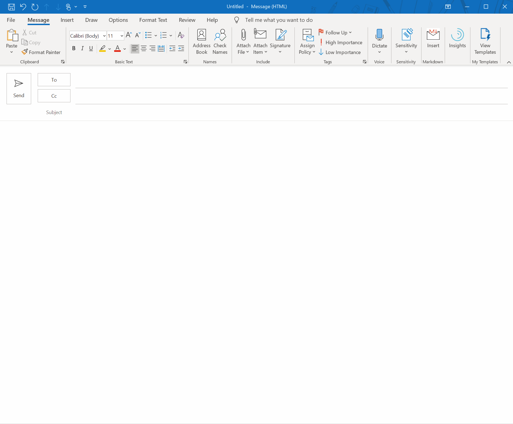

#  Markdown in Outlook

This is an add-in for Outlook which can help you edit the markdown, covert it to html and insert it to the email body.

## Install

1. Follow the instruction in [Sideload Outlook add-ins for testing](https://docs.microsoft.com/en-us/office/dev/add-ins/outlook/sideload-outlook-add-ins-for-testing) to install the add-in to Outlook.
1. In the **Custom add-ins** section, select **Add from a file** and choose the downloaded `manifest.xml` file. If you do not have the file, open `https://olmd.chunliu.me/manifest.xml` in a browser and save the page as `manifest.xml`.

## How to use

The add-in works for the compose scenario.

## Libraries

The following libraries are used in the add-in.

- [showdown](https://github.com/showdownjs/showdown)
- [React Border Wrapper](https://github.com/Metroxe/react-border-wrapper)
